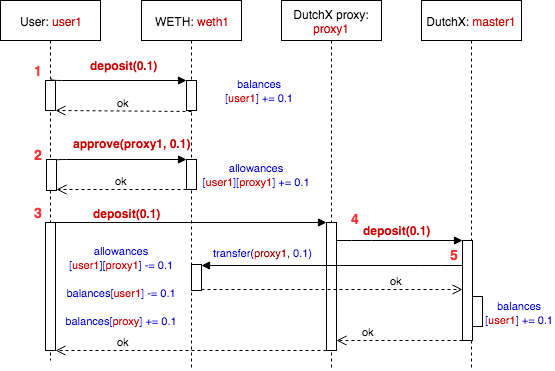
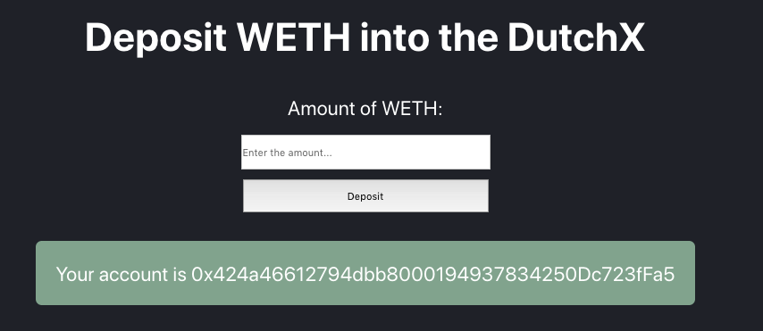

# Basic DutchX Web - Deposit WETH
We will make a small app that deposits `WETH` (Wrapped Ether) into the DutchX.

The app will be something like:

<p align="center">
  
</p>

This example will guide you through so you'll learn:
* What are the important contracts for DutchX and workflows
* How to create a dApp from scratch that uses the DutchX contracts
* How does the deposit of the DutchX works (Ether, WETH or any other token)
* This example, can be continued to invoke other simpler function like the ones
  for submiting sell orders or buy orders.

For this example you'll need:
* **Metamask**: https://metamask.io/
* **Node JS**: https://nodejs.org/en/
* **React Create App**: https://github.com/facebook/create-react-app

Also, it would be good if before you start, you get some Rinkeby Ether:
* **Get some Rinkeby Ether**: https://faucet.rinkeby.io

> This example is part of the documentation in http://dutchx.readthedocs.io/en/latest/
>
> You can find other examples in the [Build on top of DutchX project](https://github.com/gnosis/dx-examples-dev)


## 1. Undersanding the deposit of WETH (or any other ERC20 token)
In order to deposit something in the DutchX, it must be an ERC20 token.

Ether is not an ERC20 token, this is why we need to wrap it first, this means 
that we need to **send some ether to the `deposit` function in a token contract called WETH (Wrapped Ether))**:
* WETH contract: https://rinkeby.etherscan.io/address/0xc778417e063141139fce010982780140aa0cd5ab#code
* Info about WETH: https://weth.io
* More info about WETH: https://blog.0xproject.com/canonical-weth-a9aa7d0279dd

Other important thing we should know, is that the `deposit` function in DutchX, 
will call the ERC20 token contract `transferFrom` function to withdraw the 
amount for the user:
* This `transferFrom` will fail if the user don't set an allowance of at least
  the deposited amount for the DutchX proxy address (entry point for DutchX)
* So you first need to invoke the `approve` function
* This step is **mandatory** for WETH and for any other ERC20 token.

This sequence diagram will show you the 3 important operations we will do in 
this example:
1. **Wrap 0.1 WETH**: Remember Ether is not ERC20 compatible, so we need to do this 
  step (`deposit` function on WETH contract).
2. **Set allowance, so DutchX proxy can transfer 0.1 WETH**: Otherwise the
  deposit will fail, because the DutchX wouln't be entitled to do the operation.
3. **Deposit 0.1 ETH in DutchX proxy**: If we did the two prior steps, the user
  will have 0.1 WETH more in it's balance.



## 2. Create a basic web
For this basic example, we will use `reate-react-app` because it creates a 
basic React web, with nice defaults.

```bash
reate-react-app dx-basic-web
cd dx-basic-web
yarn start
```

Remove the logo file and cleanup `App.js` so it's empty HTML and we can 
start to code the app.

Add a basic markup with an input for the amount, and the button for the 
deposit.

Aditionally, add a message to be able to display the success of the operation.

Your `src/App.js` should look something like:

```jsx
import React, { Component } from 'react';
import './App.css';

class App extends Component {
  state = {
    amount: '',
    message: null
  }

  deposit = async () => {
    const [ account ] = await web3.eth.getAccounts()
    this.setState({
      message: `Mmmmm, I think you have to do something else to make it work`
    })
  }

  render() {
    return (
      <div className="App">
        <header className="App-header">
          <h1>Deposit WETH into the DutchX</h1>

          <label>Amount of WETH:</label>
          <input          
            value={ this.state.amount }
            onChange={ event => this.setState({ amount: event.target.value }) }
            placeholder="Enter the amount..."
            />
          <button onClick={ this.deposit }>Deposit</button>

          { this.state.message && (
            <div className="message">
              <span className="times" onClick={ () => this.setState({ message: null }) }>&times;</span>
              { this.state.message }
            </div>
          )}
        </header>
      </div>
    );
  }
}

export default App;
```

Style a bit the inputs and message (`src/App.css`):
```css
.message {
  text-align: left;
  padding: 0.5em;
  margin: 1em 0;
  background-color:#92b19e;
  color: white;
  border-radius: 0.3em;
}

.message li strong {
  color: #404040;
}

.message .times{
  float: right;
  display: block;
  cursor: pointer;
}

input, button {
  padding: 1em 0;
  width: 25em;
}

label, input, button {
  margin: 0.5em;
}
```

## 3. Use web3 to access the blockchain
Install web3:
```bash
npm install web3@1.0.0-beta.36 --save
```

Now we'll use web3, to interact with the blockchain.

> Checkout https://github.com/ethereum/web3.js/#usage

Create a file `src/web3.js` with the following content:

```js
import Web3 from 'web3'

let web3
if (typeof window.web3 !== 'undefined') {
  web3 = new Web3(window.web3.currentProvider);
} else {
  // For this example, we just assume we get the `web3` object injected
  alert('Please, install Metamask :)')
}

export default web3

```

Import the `web3.js` and change the deposit function to show the **Metamask**
account:

```jsx
// ...
import web3 from './web3';

class App extends Component {
  deposit = async () => {
    // Get the first account from Metamask
    const [ account ] = await web3.eth.getAccounts()
    this.setState({
      message: `Your account is ${account}`
    })
  }

  // ...
}
```

The app should look like this:



## 4. Get the ABI from Etherscan for the DutxhX
Check out the **Rinkeby**'s addresses for the DutchX in the documentation:
* https://dutchx.readthedocs.io/en/latest/smart-contracts_addresses.html

Write down the address for the **Proxy Contract**, we will need that later:
* `0x4e69969d9270ff55fc7c5043b074d4e45f795587`

Get from Etherscan the ABI for DutchExchange contract, and save it in 
[src/abi-dutchx.json](./src/abi-dutchx.json)
* Master DutchExchange contract: https://rinkeby.etherscan.io/address/0x9e5e05700045dc70fc42c125d4bd661c798d4ce9#code

## 5. Get the ABI from Etherscan for the Wrapped Ether
The official address for Rinkeby WETH is:
* `0xc778417e063141139fce010982780140aa0cd5ab`

> For more info about WETH:
>   * https://weth.io
>   * https://blog.0xproject.com/canonical-weth-a9aa7d0279dd

Our wallet should have some Ether already, so if you don't have it yet, please 
get it from:
* https://faucet.rinkeby.io

Get the ABI for DutchExchange contract, and save it in 
[src/abi-weth.json](./src/abi-weth.json)
* Wrapped Ether contract: https://rinkeby.etherscan.io/address/0xc778417e063141139fce010982780140aa0cd5ab#code


## 6. Instanciate the contracts
> First consider reading https://web3js.readthedocs.io/en/1.0/web3-eth-contract.html

Instanciate the contract and get the **auctioneer** from it (https://github.com/gnosis/dx-contracts/blob/master/contracts/DutchExchange.sol#L32):

```jsx
// ...

// Include the ABIs and the addresses
import abiDutchx from './abi-dutchx'
import abiWeth from './abi-weth'

const addressDutchx = '0x4e69969d9270ff55fc7c5043b074d4e45f795587'
const addressWeth = '0xc778417e063141139fce010982780140aa0cd5ab'

class App extends Component {   
  componentDidMount () {
    // Instanciate the contract
    this.dutchx = new web3.eth.Contract(abiDutchx, addressDutchx)
    this.weth = new web3.eth.Contract(abiWeth, addressWeth)

    // Test to get some basic data
    this.dutchx.methods
      .auctioneer()
      .call()
      .then(auctioneer => {
        console.log('The DutchX Auctioneer is: %s', auctioneer)
      })
      .catch(console.error)
  }

  // ...
}
```

**Make sure you are in RINKEBY** otherwise, you'll get an error.

You should see something like:


## 7. Get balances
Before we implement the deposit, we will create a new handy button that will 
tell us:
* **Ether balance**: It should be the same as what Metamask reports.
* **WETH Balance**: The balance of Wrapped Ether.
* **WETH Allowance for DutchX**: The allowance that DutchX has for WETH.
* **WETH balance in DutchX**: The amount of WETH that we have deposited into the
 DutchX.

 Let's add one new button and a function that get all the balances from our
 contracts:

```jsx
class App extends Component {
  // ...

  getBalances = async () => {
    const [ account ] = await web3.eth.getAccounts()
    console.log('Get balances for %s', account)

    const etherBalancePromise = web3.eth
      .getBalance(account)
      .then(web3.utils.fromWei)

    const wethBalancePromise = this.weth.methods
      .balanceOf(account)
      .call()
      .then(web3.utils.fromWei)

    const wethAllowancePromise = this.weth.methods
      .allowance(account, addressDutchx)
      .call()
      .then(web3.utils.fromWei)

    const dutchxBalancePromise = this.dutchx.methods
      .balances(addressWeth, account)
      .call()
      .then(web3.utils.fromWei)

    // Wait for all promises
    const [
      etherBalance,
      wethBalance,
      wethAllowance,
      dutchxBalance,
    ] = await Promise.all([
      etherBalancePromise,
      wethBalancePromise,
      wethAllowancePromise,
      dutchxBalancePromise,
    ])

    this.setState({
      message: (
        <div>
          <strong>Balances</strong>
          <ul>
            <li><strong>Ether</strong>: { etherBalance }</li>
            <li><strong>WETH balance</strong>: { wethBalance }</li>
            <li><strong>WETH allowance for DutchX</strong>: { wethAllowance }</li>
            <li><strong>Balance in DutchX</strong>: { dutchxBalance }</li>
          </ul>
        </div>
      )
    })

  render() {
    return (
      
      <div className="App">
        {/* ... */}

        <button onClick={ this.getBalances }>Get balances</button>

        {/* ... */}
      </div>
    )
  }
}
```

## 8. Wrap some Ether
Same as before, we add a new button and a new method:

```jsx
class App extends Component {
  // ...

  wrapEther = async () => {
    const [ account ] = await web3.eth.getAccounts()
    const amount = this.state.amount

    const txReceipt = await this.weth.methods
      .deposit()
      .send({
        from: account,
        value: web3.utils.toWei(amount)
      })

    const { transactionHash } = txReceipt
    this.setState({
      message: (
        <div>
          <p>Wraped { amount } Ether.</p>
          <p>See transaction in EtherScan:<br />
            <a href={ 'https://rinkeby.etherscan.io/tx/' + transactionHash }>{ transactionHash }</a></p>
        </div>
      )
    })
  }

  render() {
    return (
      <div className="App">
        {/* ... */}

        <button onClick={ this.wrapEther }>Wrap Ether</button>

        {/* ... */}
      </div>
    )
  }
}

```

## 9. Set an allowance in WETH for the DutchX
Same as before, we add a new button and a new method:

```jsx
class App extends Component {
  // ...

  setAllowance = async () => {
    const [ account ] = await web3.eth.getAccounts()
    const amount = this.state.amount

    const txReceipt = await this.weth.methods
      .approve(addressDutchx, web3.utils.toWei(amount))
      .send({
        from: account
      })

    const { transactionHash } = txReceipt
    this.setState({
      message: (
        <div>
          <p>Allowance changed to { amount }.</p>
          <p>See transaction in EtherScan:<br />
            <a href={ 'https://rinkeby.etherscan.io/tx/' + transactionHash }>{ transactionHash }</a></p>
        </div>
      )
    })
  }

  render() {
    return (
      <div className="App">
        {/* ... */}

        <button onClick={ this.deposit }>Deposit</button>

        {/* ... */}
      </div>
    )
  }
}
```

## 10. Do the deposit
In this step, we will implement the deposit of the WETH (Wrapped Ether).

The deposit on the DutchX will fail if you don't have:
* Enough balance of WETH
* The DutchX should have allowance for the amount

Check out the deposit function of the DutchX:
* https://github.com/gnosis/dx-contracts/blob/master/contracts/DutchExchange.sol#L351

We update the deposit function to:
```jsx
```


## Next steps
Congratulations! Now you've built a nice basic web to wrap ether, set the 
allowances and deposit tokens into the DutchX.

Although this way of using the contracts works for many projects, others prefer
to work using a local node like `ganache-cli` to speed up the development.

Also, for medium size projects, you'll find yourself doing things that are 
**much easier using truffle** (test, migrations, interaction, sharing contracts,
etc...)

Next step will show you how to create a project from scratch that depends on 
the DutchX NPM Package and migrate all the contracts to a local ganache.
* [Example 02: Truffle migrate](https://github.com/gnosis/dx-examples-dev/tree/master/02_truffle-migrate): 